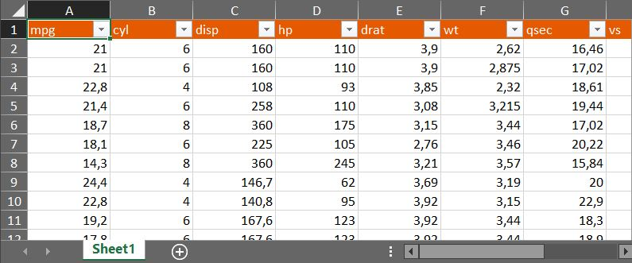
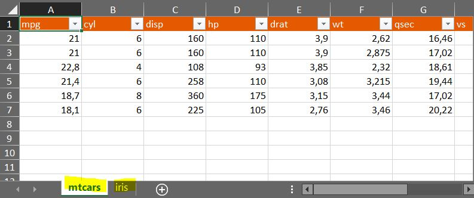
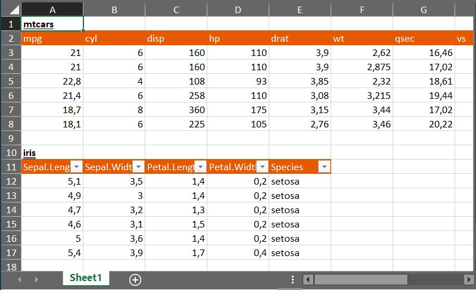
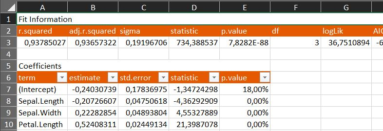

<!-- README.md is generated from README.Rmd. Please edit that file -->

```{r, include = FALSE}
knitr::opts_chunk$set(
  collapse = TRUE,
  comment = "#>",
  fig.path = "man/figures/README-",
  out.width = "100%"
)
```

# xlbox

<!-- badges: start -->
<!-- badges: end -->

The goal of `xlbox` is to provide fast, simple and customizable export of multiple datasets to xlsx. Package is built on top of `openxlsx` package and export is based on simple list structure. 

Core function of `xlbox` is `write_xlsx`. Two main usage cases of `write_xlsx`:

1. Export list of data frames to multi-sheet xlsx, where each data frame is written to separate sheet
2. Export list of data frames to single sheet (with `xlsheet`), one-by-one in column or row

`xlbox` is not limited only to the data frame export, one can define custom export transformation for R objects with `write_data` S3 class. After that `write_xlsx` will manage export of each object according to it's class.

## Installation

<!-- You can install the released version of xlbox from [CRAN](https://CRAN.R-project.org) with: -->

<!-- ``` r -->
<!-- install.packages("xlbox") -->
<!-- ``` -->

You can install the development version of xlbox from [GitHub](https://github.com/) with:

``` r
# install.packages("devtools")
devtools::install_github("vrkrv/xlbox")
```

## Main usage cases

This is an example which shows you how to typical export looks like:

```{r main_usage, eval = FALSE}
library(xlbox)
library(magrittr)

# single data frame export:
mtcars %>% write_xlsx

# export list of data frames to multiple sheets:
df_list <- list(mtcars = mtcars %>% head(), iris = iris %>% head())
df_list %>% write_xlsx

# export list of data frames to single sheet one under another (in a column):
df_list %>% xlsheet %>% write_xlsx

# export list of data frames to single sheet one under another (in a row):
df_list %>% xlsheet %>% write_xlsx(rowwise = TRUE)

```





## Custom object export

For custom object one can create specific export rules with `openxlsx` package.
Export rules for `write_xlsx` function are defined in S3 class `write_data`.
To create custom export for object of specific class corresponding `write_data` method must be designed.

Let's create an example of custom export for `lm` object. 
In our custom report we want to have fit characteristics and coefficients. 
We will use `broom` package to extract this information.

So let's define our `write_data.lm`:

```{r lm_export, eval = FALSE}
library(openxlsx)
library(broom)
write_data.lm <- function(wb, sheet, data, startRow = 1, startCol = 1, ...) {
  fit_info <- glance(fit)
  coef_df <- tidy(fit)
  
  srow = startRow
  scol = startCol
  
  # place header on the first row and merge first line:
  writeData(wb, sheet, "Fit Information", startRow = srow, startCol = scol, ...)
  mergeCells(wb, sheet, cols = scol + 1:ncol(fit_info) - 1, rows = srow)
  srow <- srow + 1
  
  # place fit_info:
  writeData(wb, sheet, fit_info, startRow = srow, startCol = scol, ...)
  srow <- srow + nrow(fit_info) + 2
  
  # the same for coefficients:
  writeData(wb, sheet, "Coefficients", startRow = srow, startCol = scol, ...)
  mergeCells(wb, sheet, cols = scol + 1:ncol(coef_df) - 1, rows = srow)
  srow <- srow + 1
  # apply accounting style for values:
  class(coef_df$p.value) <- "percentage" 
  writeData(wb, sheet, coef_df, startRow = srow, startCol = scol, ...)
}

# test how lm will export to xlsx:
fit <- lm(Petal.Width ~ . - Species, data = iris)
fit %>% write_xlsx
```



Now if you will provide list of `lm` object or, for example, mixture of `lm` objects and data frames,
`lm` objects will be always formatted in the same way.

However, for such a simple one-time custom report we can make it quickly through this syntax (but without header merge):

```{r lm_export2, eval = FALSE}
library(dplyr)

lm_list <- list(
  `Fit Information` = glance(fit),
  `Coefficients` = fit %>% tidy %>% mutate_at("p.value", as_percentage) 
)

lm_list %>% xlsheet %>% write_xlsx()
```

